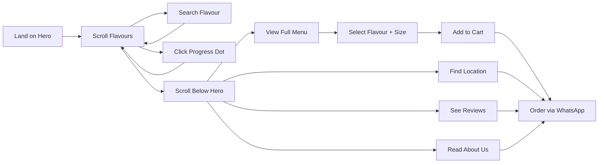

# Cone Joys Complete Landing Page — Features Guide

> **Project:** Cone Joys Ice Cream
> **Current State:** Scroll-based hero with 12 flavours, search, WhatsApp ordering
> **Goal:** What sections/features to add for a complete landing page

---

## Current Status (Already Built ✅)

| Feature | Status | Location |
|---------|--------|----------|
| Scroll-based flavour hero | ✅ Done | `cone-scroll.html` / `components/ConeStory.tsx` |
| 12 flavour cones with images | ✅ Done | `data/flavours.ts` / `assets/cones/` |
| Live search with suggestions | ✅ Done | Search bar in nav |
| Progress dots with tooltips | ✅ Done | Right rail |
| Previous/Next arrow buttons | ✅ Done | Progress rail |
| WhatsApp ordering links | ✅ Done | "Order online" & "Get this scoop" |
| Responsive design (mobile to desktop) | ✅ Done | Tailwind responsive classes |
| Reduced motion support | ✅ Done | `prefers-reduced-motion` |
| WebP image format | ✅ Done | `.webp` assets available |
| Background colour transitions | ✅ Done | Per-flavour background |

---

## Recommended Sections to Add

### 1. 🍦 About / Brand Story Section

**Purpose:** Tell customers who Cone Joys is and what makes them special.

```
┌─────────────────────────────────────┐
│  "Our Story"                        │
│                                     │
│  [Brand Image]  │  Text:            │
│                  │  - Who we are    │
│                  │  - What makes us │
│                  │    different     │
│                  │  - Quality promise│
└─────────────────────────────────────┘
```

**Suggested content:**
- Brand origin story (Pakistan-based)
- Quality commitment (fresh ingredients, natural flavours)
- Small batch / handmade angle
- CTA: "Learn more about us"

---

### 2. 🍨 Full Menu / Pricing Grid

**Purpose:** Show all flavours with prices, sizes, and options.

```
┌─────────────────────────────────────┐
│  "Our Menu"                         │
│                                     │
│  ┌──────┐ ┌──────┐ ┌──────┐       │
│  │Mango │ │Kulfa │ │Choc  │  ...   │
│  │$2.50 │ │$2.50 │ │$2.50 │       │
│  │Cone  │ │Cone  │ │Cone  │       │
│  └──────┘ └──────┘ └──────┘       │
│                                     │
│  Size options:                      │
│  [Small] [Medium] [Large]          │
│  Cup: $X  |  Cone: $Y  |  Family: $Z│
└─────────────────────────────────────┘
```

**Data to add in [`data/flavours.ts`](data/flavours.ts):**
- `price` (number)
- `category` ("fruity", "chocolatey", "classic", "premium")
- `description` (short, 1-2 lines)
- `ingredients` (optional)
- `isAvailable` (boolean)

---

### 3. 📸 Instagram / Social Proof Gallery

**Purpose:** Build trust with real customer photos and social media presence.

```
┌─────────────────────────────────────┐
│  "Follow Us @ConeJoys"             │
│                                     │
│  [Img1] [Img2] [Img3]              │
│  [Img4] [Img5] [Img6]              │
│                                     │
│  Instagram feed integration         │
└─────────────────────────────────────┘
```

**Options:**
- Static gallery of brand photos
- Instagram embed (lightweight)
- Customer review cards with photos
- "Tag us to get featured" CTA

---

### 4. ⭐ Customer Reviews / Testimonials

**Purpose:** Social proof — real reviews build trust.

```
┌─────────────────────────────────────┐
│  "What Our Customers Say"          │
│                                     │
│  ⭐⭐⭐⭐⭐                          │
│  "Best ice cream in town! The      │
│   mango flavour is incredible."    │
│  — Ayesha K.                       │
│                                     │
│  ⭐⭐⭐⭐⭐                          │
│  "Love the variety. Kulfa is my    │
│   go-to every time."               │
│  — Hassan R.                       │
└─────────────────────────────────────┘
```

**Implementation:**
- Carousel or grid of testimonial cards
- Star rating
- Customer name + location
- Optional: photo

---

### 5. 📍 Location / Hours / Contact

**Purpose:** Tell customers where to find you.

```
┌─────────────────────────────────────┐
│  "Visit Us"                         │
│                                     │
│  📍 Address: XYZ Street, City      │
│  🕐 Hours: Mon-Sun, 11AM-11PM     │
│  📞 Phone: +92 XXX XXXXXXX        │
│  📧 Email: hello@conejays.com     │
│                                     │
│  [Google Maps Embed]               │
└─────────────────────────────────────┘
```

---

### 6. 🛒 Order Builder / Cart System

**Purpose:** Let customers build their order before going to WhatsApp.

```
┌─────────────────────────────────────┐
│  "Build Your Order"                │
│                                     │
│  Step 1: Pick flavour ──────────┐  │
│  Step 2: Choose size ───────────┤  │
│  Step 3: Add extras (toppings) ─┤  │
│  Step 4: Review & Order ────────┘  │
│                                     │
│  [Add to Cart]  [View Cart (3)]    │
└─────────────────────────────────────┘
```

**Flow:**
1. User selects flavour(s)
2. Chooses size (Small/Medium/Large/Family)
3. Adds toppings (optional)
4. Reviews order summary
5. CTA: "Order via WhatsApp" → pre-filled message with order details

---

### 7. 🎯 Special Offers / Deals Section

**Purpose:** Promote discounts, combos, and seasonal specials.

```
┌─────────────────────────────────────┐
│  "Today's Deals"                    │
│                                     │
│  🎉 Buy 2 Get 1 Free               │
│  🌟 New flavour: [Name]            │
│  🏆 Combo: 3 cones for $X          │
│                                     │
│  Countdown timer (optional)        │
└─────────────────────────────────────┘
```

---

### 8. 📱 Mobile App / Delivery Partners

**Purpose:** If you have a mobile app or partner with delivery services.

```
┌─────────────────────────────────────┐
│  "Order on Your Favorite App"      │
│                                     │
│  [Foodpanda] [EatEasy] [JazzCash] │
│                                     │
│  Or download our app:              │
│  [App Store] [Google Play]         │
└─────────────────────────────────────┘
```

---

### 9. 📧 Newsletter / Email Signup

**Purpose:** Capture leads for marketing.

```
┌─────────────────────────────────────┐
│  "Stay in the Loop"                │
│                                     │
│  Get updates on new flavours,      │
│  offers, and events.               │
│                                     │
│  [Enter your email...] [Subscribe] │
│                                     │
│  "No spam, unsubscribe anytime."   │
└─────────────────────────────────────┘
```

---

### 10. 🦶 Footer (Complete)

**Purpose:** All important links in one place.

```
┌─────────────────────────────────────┐
│  [Logo]                             │
│                                     │
│  Quick Links  │  Contact    │ Social│
│  ───────────  │  ────────   │ ─────│
│  Home         │  📞 Phone   │ [FB] │
│  Menu         │  📧 Email   │ [IG] │
│  About        │  📍 Address │ [WA] │
│  Contact      │             │      │
│                                     │
│  © 2025 Cone Joys. All rights      │
│  reserved.                          │
└─────────────────────────────────────┘
```

---

## Priority Order Recommendation

| Priority | Section | Effort | Impact | Why |
|----------|---------|--------|--------|-----|
| 🥇 **P1** | Full Menu / Pricing Grid | Medium | High | Customers need prices |
| 🥇 **P1** | Location / Hours / Contact | Low | High | Essential business info |
| 🥇 **P1** | Footer (Complete) | Low | High | Navigation & credibility |
| 🥈 **P2** | About / Brand Story | Medium | Medium | Builds brand trust |
| 🥈 **P2** | Customer Reviews | Medium | Medium | Social proof |
| 🥈 **P2** | Order Builder | High | High | Increases conversions |
| 🥉 **P3** | Instagram Gallery | Medium | Medium | Visual social proof |
| 🥉 **P3** | Special Offers | Low | Medium | Promotional |
| 🥉 **P3** | Newsletter Signup | Low | Low | Long-term marketing |
| 🥉 **P3** | Delivery Partners | Low | Low | Convenience |

---

## Technical Implementation Notes

### For Next.js App (`app/` directory)
- Create new components in `components/` folder
- Add sections below `<ConeStory />` in [`app/page.tsx`](app/page.tsx)
- Use Tailwind for styling (already configured)
- Add new data files in `data/` folder

### For Static HTML (`cone-scroll.html`)
- Add sections after the scroll-story `div`
- Maintain same Tailwind classes
- Keep the same design tokens (`--ink`, `--panel`, `--line`)

### Design Consistency
- Use existing design tokens from [`design.md`](design.md)
- Keep font families: DM Sans (body) + Manrope (headings)
- Maintain `#15150f` (ink) and `#fffdf4` (panel) colour scheme
- Follow responsive patterns already established

---

## Mermaid: User Journey Flow



---

## Next Steps

1. Decide which sections to implement first (use priority table above)
2. For each section, create detailed component specs
3. Implement in order: P1 → P2 → P3
4. Test responsiveness after each section
5. Deploy and verify

> **Note:** The current scroll-hero is already production-quality. New sections should be added **below** the hero (after the `scroll-story` div ends), so the hero experience remains intact.
