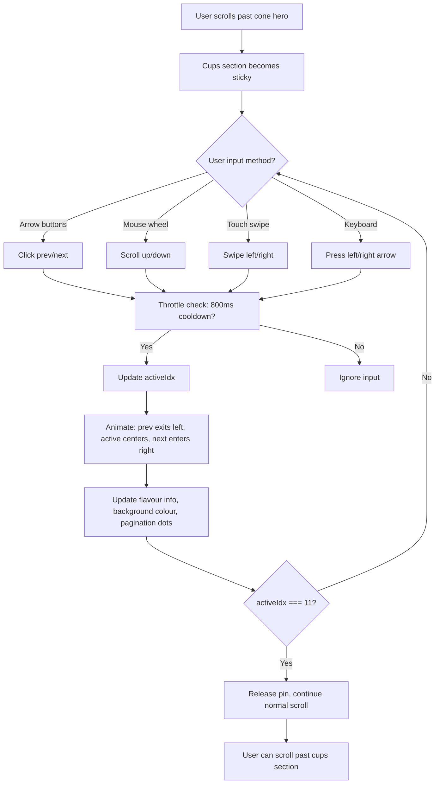
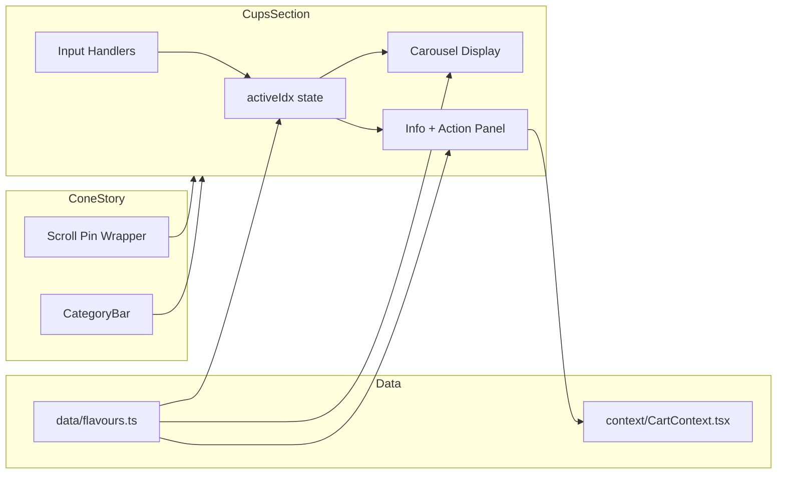

# CupsSection Redesign Plan

## Overview
Complete rewrite of [`components/CupsSection.tsx`](components/CupsSection.tsx) to create a premium, centered carousel with scroll-pin mechanic, layered cup transitions, and full responsiveness.

---

## Architecture

### Component Structure
```
CupsSection (client component)
├── Scroll-pin wrapper (sticky container)
│   ├── Section background (soft complementary shade)
│   ├── Heading / Subheading
│   ├── Carousel area
│   │   ├── Previous arrow button
│   │   ├── Cup display (prev | active | next)
│   │   └── Next arrow button
│   └── Bottom panel
│       ├── Flavour info (index label, name, size)
│       ├── Quantity control + Add to Cart
│       └── Pagination dots
└── Scroll progress tracker (intersection observer + scroll listener)
```

### Data Flow
- `activeIdx` state (0-11) drives which cup is displayed
- `FLAVOURS` array from [`data/flavours.ts`](data/flavours.ts) provides all cup data
- Cart operations via [`context/CartContext.tsx`](context/CartContext.tsx) (unchanged)
- Scroll progress tracked via `useScroll` from framer-motion (or rAF with cleanup)

---

## Implementation Steps

### Step 1: Install framer-motion
```bash
npm install framer-motion
```
**Why:** Provides `useScroll`, `useTransform`, `useMotionValue` for GPU-friendly scroll tracking without continuous React state updates. Also provides `AnimatePresence` for smooth cup transitions.

### Step 2: Verify and Fix Cup Image Assets
Check each cup image in [`public/assets/cups/`](public/assets/cups/) against its flavour:

| Flavour | Expected Colour | Image Path | Status |
|---------|----------------|------------|--------|
| Mango | Yellow/Orange | `mango.png` | Verify |
| Kulfa | Cream/Pale | `kulfa.png` | Verify |
| Chocolate Chip | Brown | `chocolate.png` | Verify |
| Black Currant | Purple | `blueberry.png` | Verify |
| Caramel Crunch | Caramel Brown | `caramel-crunch.png` | Verify |
| Tutti Frutti | Pink | `tutti-frutti.png` | Verify |
| Coffee Chino | Coffee Brown | `coffee-chino.png` | Verify |
| Pista | Green | `pistachio.png` | Verify |
| Vanilla | Pale Yellow | `vanilla.png` | Verify |
| Strawberry | Pink/Red | `strawberry.png` | Verify |
| Coconut Delight | White/Cream | `coconut.png` | Verify |
| Kit Kat | Brown/Red | `kitkat.png` | Verify |

**Action:** If any image has wrong scoop colour, replace with correct transparent PNG/WebP. Remove CSS filters that could recolor images.

### Step 3: Rewrite CupsSection.tsx — Core Carousel

#### 3a. State Management
```typescript
const [activeIdx, setActiveIdx] = useState(0);
const [isTransitioning, setIsTransitioning] = useState(false);
const [quantities, setQuantities] = useState<Record<string, number>>({});
const [isAdded, setIsAdded] = useState(false);
const { addToCart } = useCart();
```

#### 3b. Centered Carousel Layout
- Container: `relative w-full max-w-[1400px] mx-auto`
- Three visible cups: prev (left, partially visible), active (center, large), next (right, partially visible)
- Active cup: `z-20`, `opacity-100`, `scale-100`
- Adjacent cups: `z-10`, `opacity-35`, `scale-80`
- Use absolute positioning with `left-1/2 -translate-x-1/2` as anchor
- Offset prev cup: `translateX(-calc(50% + offset))` where offset = ~60% of active cup width
- Offset next cup: `translateX(calc(50% + offset))`

#### 3c. Responsive Active Cup Sizes
```css
/* Desktop */
width: clamp(300px, 25vw, 440px);

/* Tablet (768px) */
@media (max-width: 1024px) {
  width: clamp(280px, 38vw, 380px);
}

/* Mobile (390px) */
@media (max-width: 640px) {
  width: clamp(230px, 68vw, 310px);
}
```

#### 3d. Cup Image Display
```tsx

```
- No CSS filters that change colours
- Use `object-contain` to preserve aspect ratio
- Soft colour-matched shadow beneath active cup

### Step 4: Scroll-Pin Mechanic

#### 4a. Scroll Container Setup
```tsx
// Wrapper in ConeStory.tsx or CupsSection itself
<div ref={pinRef} className="relative" style={{ height: `${FLAVOURS.length * 100}vh` }}>
  <div className="sticky top-0 min-h-[100dvh] overflow-hidden">
    {/* Cups carousel content */}
  </div>
</div>
```

#### 4b. Scroll Progress → Cup Index Mapping
- Use `framer-motion`'s `useScroll` + `useTransform` to map scroll progress (0 to 1) to cup index (0 to 11)
- OR use `IntersectionObserver` + rAF with proper cleanup
- After cone flavours end (scroll past the 1200vh cone track), the cups section becomes sticky
- Scroll progress through the cups section maps linearly: `progress * 11` → `Math.round()` → active index
- After index 11 (Kit Kat), release the pin and continue normal scrolling

#### 4c. Preventing Rapid Skipping
- Debounce wheel events: only allow one flavour change per scroll step
- Use a `lastScrollTime` ref to throttle
- On wheel event, if `deltaY > threshold` and cooldown elapsed, advance one step

### Step 5: Input Methods

#### 5a. Arrow Buttons
```tsx
<button onClick={goToPrev}> ← </button>
<button onClick={goToNext}> → </button>
```
- Circular buttons with white background, shadow, hover effects
- Positioned at left/right edges of carousel area

#### 5b. Mouse Wheel / Vertical Scroll
- When cups section is in viewport and pinned, intercept wheel events
- `deltaY > 0` → next cup, `deltaY < 0` → previous cup
- Throttle: 800ms cooldown between changes
- `e.preventDefault()` to prevent page scroll during pin

#### 5c. Touch Swipe
```tsx
const handleTouchStart = (e: React.TouchEvent) => { touchStartX = e.touches[0].clientX; };
const handleTouchMove = (e: React.TouchEvent) => { deltaX = e.touches[0].clientX - touchStartX; };
const handleTouchEnd = () => {
  if (Math.abs(deltaX) > 40) {
    deltaX > 0 ? goToPrev() : goToNext();
  }
};
```

#### 5d. Keyboard Arrows
```tsx
useEffect(() => {
  const handleKeyDown = (e: KeyboardEvent) => {
    if (!isCupsInViewport()) return;
    if (e.key === 'ArrowLeft') { e.preventDefault(); goToPrev(); }
    if (e.key === 'ArrowRight') { e.preventDefault(); goToNext(); }
  };
  window.addEventListener('keydown', handleKeyDown);
  return () => window.removeEventListener('keydown', handleKeyDown);
}, []);
```

### Step 6: Animation

#### 6a. Cup Transitions
- Use CSS transitions on `transform` and `opacity` only (GPU-composited)
- Duration: `450ms`
- Easing: `cubic-bezier(0.22, 1, 0.36, 1)` (existing `ease-custom` in tailwind config)
- Active cup: enters center smoothly
- Previous cup: exits left with scale down + opacity fade
- Next cup: enters from right with scale up + opacity fade

#### 6b. Reduced Motion
```tsx
const prefersReducedMotion = window.matchMedia('(prefers-reduced-motion: reduce)').matches;
// If true, skip transitions, instant swap
```

#### 6c. Background Colour Transition
- Section background transitions smoothly between flavour colours
- Use a softer complementary shade (e.g., `color-mix` or manually defined lighter variant)
- `transition-colors duration-700 ease-custom`

### Step 7: Visual Design

#### 7a. Section Layout
```
┌─────────────────────────────────────────────┐
│  "CUPS COLLECTION" (kicker)                  │
│  "Your flavour, served your way." (heading)  │
│  Subtitle text                               │
│                                              │
│     ← [prev]  [★ ACTIVE CUP ★]  [next] →    │
│                                              │
│  01 / 12  |  Mango  |  Single Scoop          │
│  [−]  1  [+]  |  [Add to Cart]              │
│  ● ● ● ● ● ● ● ● ● ● ● ●                   │
└─────────────────────────────────────────────┘
```

#### 7b. Decorative Circle
- Remove the oversized decorative circle or resize to ~30% of carousel width
- Position behind active cup only
- Soft white/translucent with subtle shadow

#### 7c. Colour Scheme
- Background: softer complementary shade of active flavour (not exact match)
- Text: `#15150f` (ink) with appropriate opacity
- Buttons: `bg-ink text-panel` for Add to Cart, white for arrows
- Quantity control: white background with ink border

#### 7d. Shadows & Depth
- Active cup: `drop-shadow(0 25px 30px rgba(40,30,15,0.22))`
- Adjacent cups: `drop-shadow(0 10px 15px rgba(40,30,15,0.12))`
- No glassmorphism (no `backdrop-blur` on cup containers)

### Step 8: Update CategoryBar.tsx
- The "Cups" button in [`components/CategoryBar.tsx`](components/CategoryBar.tsx) already scrolls to `#cups`
- Ensure it scrolls to the **start** of the cups section (not middle)
- Current implementation uses `getBoundingClientRect().top` which is correct

### Step 9: Integration in ConeStory.tsx
- [`components/ConeStory.tsx`](components/ConeStory.tsx) renders `<CupsSection />` after the cone scroll track
- The 1200vh scroll track ends → normal page flow resumes → CupsSection appears
- CupsSection needs its own scroll-pin wrapper to create the horizontal scroll effect
- After all 12 cups, release pin → normal scroll continues (or page ends)

### Step 10: Testing Matrix

| Viewport | Active Cup Visible | Controls Usable | No Overflow | Layout |
|----------|-------------------|-----------------|-------------|--------|
| 360×800 | ✓ | ✓ | ✓ | Compact vertical |
| 390×844 | ✓ | ✓ | ✓ | Compact vertical |
| 768×1024 | ✓ | ✓ | ✓ | Tablet layout |
| 1024×768 | ✓ | ✓ | ✓ | Desktop layout |
| 1366×768 | ✓ | ✓ | ✓ | Desktop layout |
| 1920×1080 | ✓ | ✓ | ✓ | Wide desktop |

---

## Files to Modify

| File | Change |
|------|--------|
| [`components/CupsSection.tsx`](components/CupsSection.tsx) | Complete rewrite |
| [`components/ConeStory.tsx`](components/ConeStory.tsx) | Add scroll-pin wrapper around `<CupsSection />` |
| [`components/CategoryBar.tsx`](components/CategoryBar.tsx) | Verify cups scroll target (likely no change needed) |
| [`package.json`](package.json) | Add `framer-motion` dependency |
| [`public/assets/cups/`](public/assets/cups/) | Replace any incorrect cup images |

## Files NOT to Modify
- [`data/flavours.ts`](data/flavours.ts) — flavour names, order, and data stay unchanged
- [`context/CartContext.tsx`](context/CartContext.tsx) — cart logic unchanged
- [`app/page.tsx`](app/page.tsx) — structure unchanged
- [`app/globals.css`](app/globals.css) — only add new keyframes if needed
- [`tailwind.config.ts`](tailwind.config.ts) — design tokens unchanged

---

## Mermaid: User Interaction Flow



---

## Mermaid: Component Data Flow



---

## Key Design Decisions

1. **No framer-motion `AnimatePresence`** — Use CSS transitions instead for better performance and simpler code. Only use framer-motion's `useScroll` if needed for scroll tracking.

2. **Three-cup rendering** — Only render prev, active, and next cups in the DOM. This keeps the DOM small and transitions fast.

3. **Scroll pin via sticky + height container** — Use a parent div with `height: ${12 * 100}vh` and a child with `sticky top-0 min-h-[100dvh]`. This creates the scroll-pin effect natively without JS.

4. **Wheel event throttling** — Use a ref-based cooldown (800ms) to prevent rapid skipping. On each wheel event, check cooldown, then advance exactly one step.

5. **Background colour** — Use a softer complementary shade per flavour. Define as `softColor` in a lookup or compute via `color-mix` with white.

6. **No autoplay** — Explicitly excluded per requirements.
